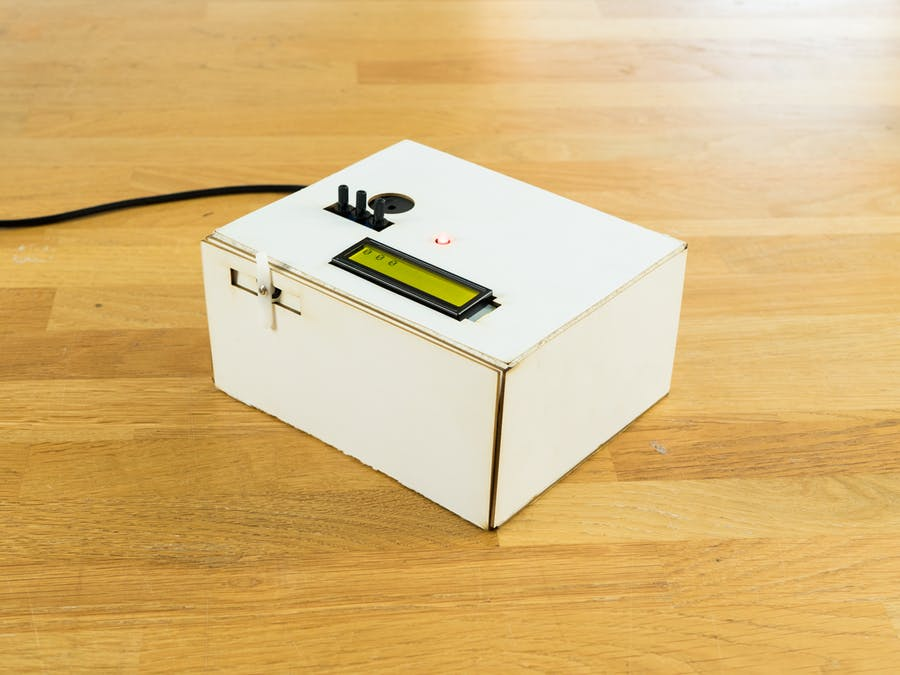
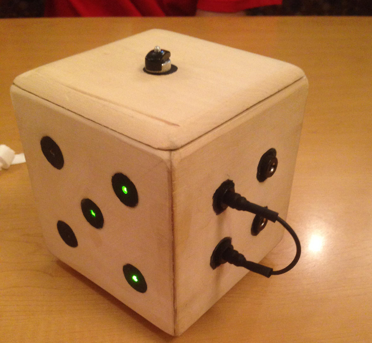
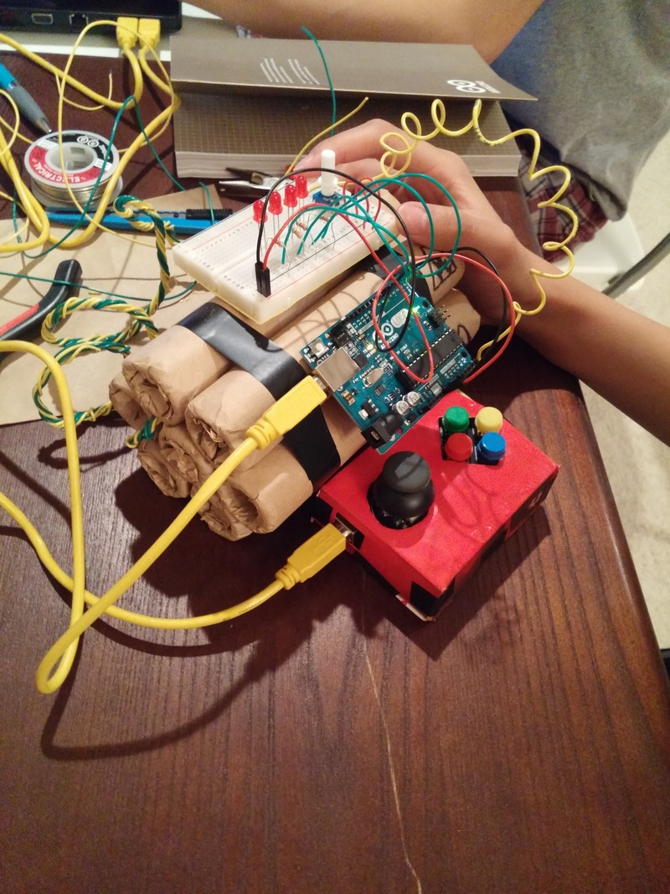
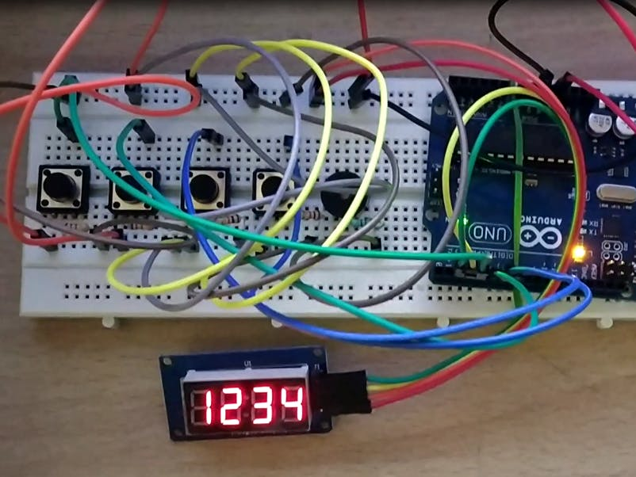
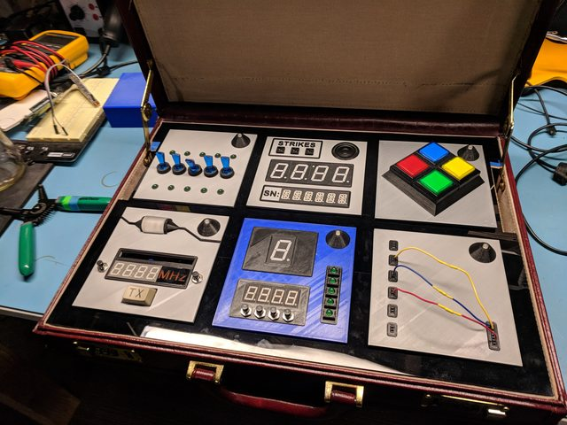
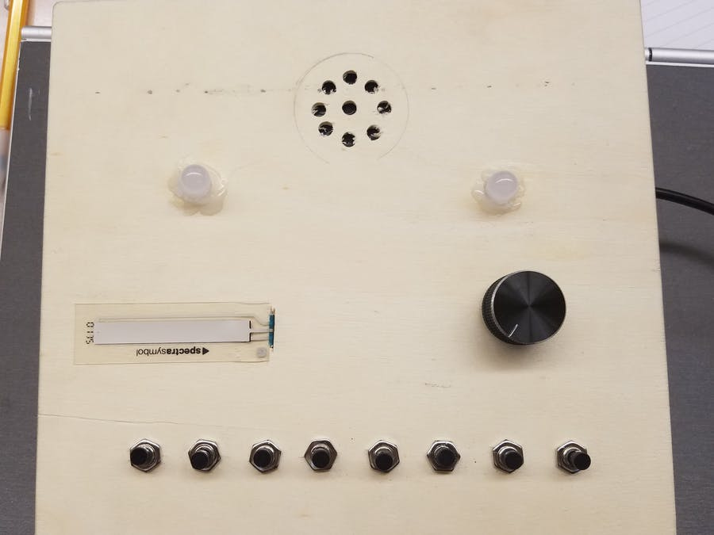
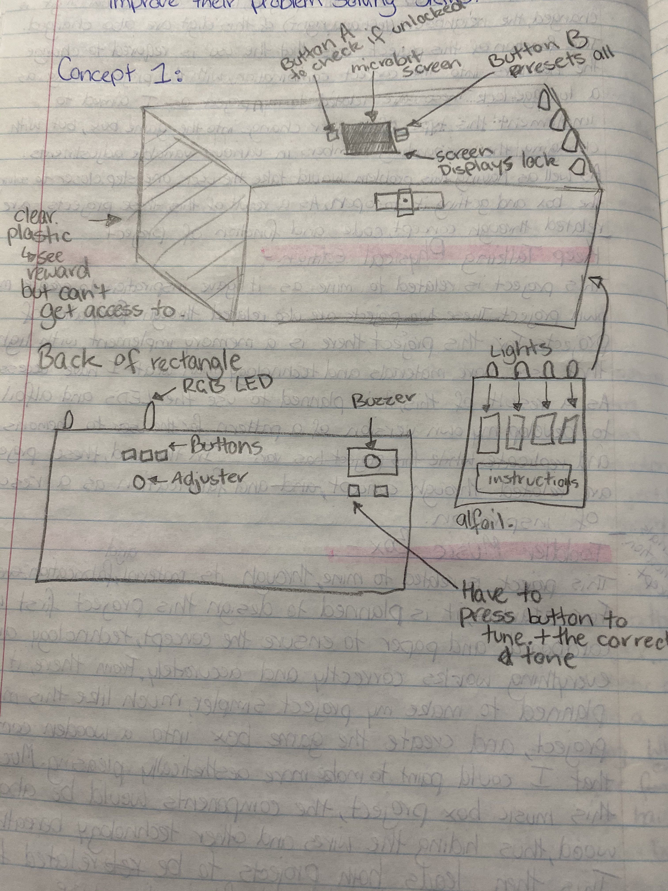
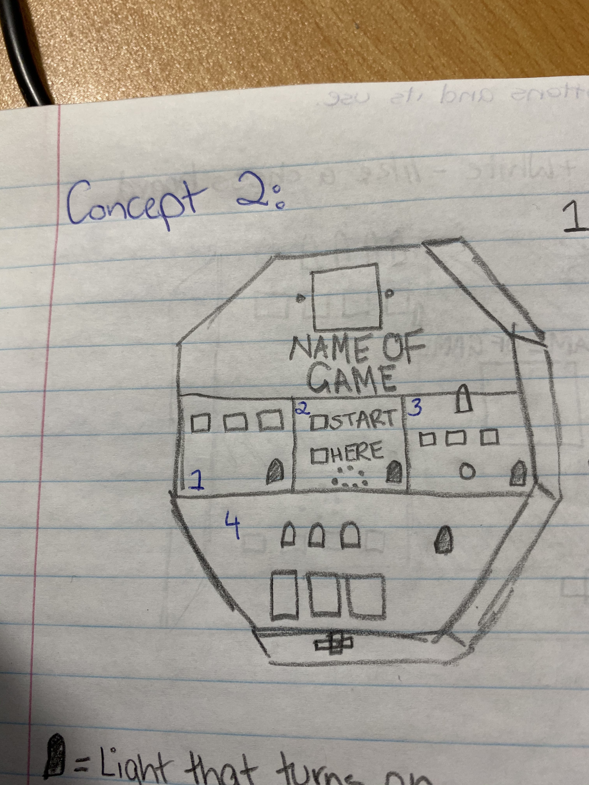
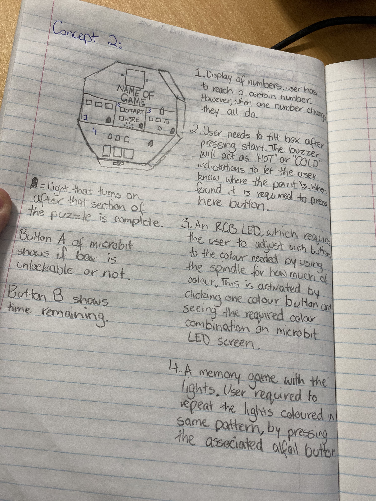
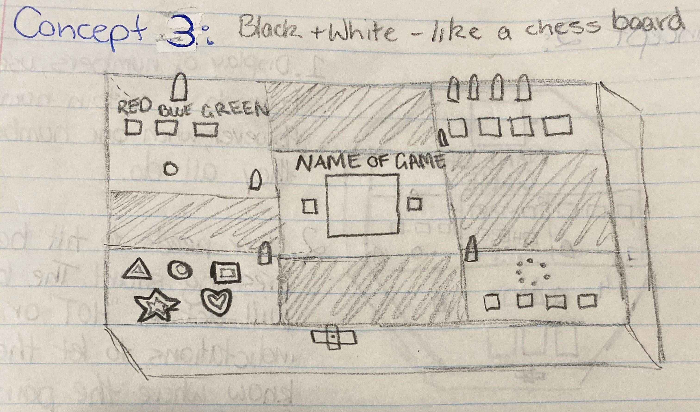

# 1701QCA Making Interaction - Assessment 2 workbook

You will use this workbook to keep track of your progress through the course and also as a process journal to document the making of your projects. The comments in italics throughout the template give suggestions about what to include. Feel free to delete those instructions when you have completed the sections.

When you have completed the template, submit the link to the GitHub Pages site for this repository as a link in Learning@Griffith. The link should be something like [https://qcainteractivemedia.github.io/1701QCA-Assessment2/](https://qcainteractivemedia.github.io/1701QCA-Assessment2/) where `qcainteractivemedia` is replaced with your GitHub username and `1701QCA-Assessment2` is replaced with whatever you called the repository this template is contained in when you set it up.

## Project working title ##
Puzzling Game Box

## Related projects ##
*Find about 6 related projects to the project you choose. A project might be related through  function, technology, materials, fabrication, concept, or code. Don't forget to place an image of the related project in the appropriate folder and insert the filename in the appropriate places below. Copy the markdown block of code below for each project you are showing.*

### Related project 1 ###
PuzzleBox

https://create.arduino.cc/projecthub/arduino/puzzlebox-c1f374?ref=search&ref_id=puzzle&offset=0

This project is related to mine because I would like the outcome of my game box to have a reward for solving the puzzle/problem. AS a result of this, this project is related to mine through the technology used and the function of said technology. For in both projects, a servo is used to unlock the box, revealing the reward for resolving the problem at hand. These servo’s horns would only be activated once the user completes or solves the problem through the use of lights, buttons, etc. to eventually activate the servo horns to activate and open. Therefore, this project is related to mine through its similarities of technology, function and concept. 

### Related project 2 ###
Electronic Puzzle Box uses only Discrete Components

https://hackaday.com/2014/05/14/electronic-puzzle-box-uses-only-discrete-components/

This project is related to mine through its concept of various puzzles for the user to solve in order to open the dice container. For my project, the user will be asked to accomplish various puzzles like obtaining a specific colour, all lights to be on or off, reaching zero or a certain number while each button adjusts in random variables. However, this project also uses the tilt function of the program, which would be cool to implement into my project as a problem to solve somehow. These lead this project to be related to mine through its concept, technology and fabrication.

### Related project 3 ###
"Bomb" Diffuse Game

https://ramenboii.weebly.com/vis-147a/final-project-bomb-diffuse-game

This project is related to mine through it’s materials, concept and code. These can be seen through the use of a separate breadbox from the mounting plate, LEDs, cardboard and paper. The cardboard and paper in this project help with the aesthetic of the game, while my project will use this combination to form a box and be decorated with paper to be aesthetically pleasing. While this project requires the user to disconnect wires to disarm, the concept and code are similar to my game box. They are similar through having a set timer to solve the problems before the box remains forever “locked”. As well as having the same concept of having to do something to get an outcome. For this project the outcome is to prevent the bomb blowing up, while my project sees a container to open up. These projects are led to be related together through material, function and code. 

### Related project 4 ###
Turning Lock Puzzle

https://create.arduino.cc/projecthub/krishnalalith/turning-lock-puzzle-356d56?ref=search&ref_id=puzzle&offset=4

This project is related to mine due to the code used and the function that it leads to. In this project, when an individual digit is changed, the neighbours (left and right) of this digit are also changed. The function of this project sees that the user is required to change the numbers into the correct combination, with this project acting as a luggage lock. These are related to my project as I aimed to implement this type of number change into the game box, but with changing the surrounding numbers in various variable adjustments. As well as having this problem would take the user one step closer to solving the box and getting it open. As a result of this, these projects are related through concept, code and function of project.

### Related project 5 ###
Keep Talking and Nobody Explodes - Physical Edition

http://www.dillonlareau.com/projects/KTANE_physical

This project is related to mine as it gave inspiration to create my own project. These two projects are also related through fabrication of projects. For this project, there is a section of the ‘bomb’ that requires the user to use their memory with the implemented lights to disarm a section. However, for this project it uses more materials and technology than what I have access to. As a result of this, it is planned to use the LED’s and alfoil to develop my own version of a pattern for the user to memorise and replicate. In the end, these projects are related through concept and fabrication as a result of inspiration.

### Related project 6 ###
Interactive Toddler Music Box Toy

https://create.arduino.cc/projecthub/68284/interactive-toddler-music-box-toy-2c8dcf?ref=search&ref_id=box&offset=28

This project is related to mine through its material and fabrication. For starters, it is planned to design my project first with cardboard and paper to ensure the concept, technology and everything words correctly and accurately. From there, it is planned to make my project simpler, much like this music box project, the components would be above the wood, thus hiding the wires and other technology beneath. This then leads both projects to be related together through their material and fabrication use. 

## Other research ##
*Include here any other relevant research you have done. This might include identifying readings, tutorials, videos, technical documents, or other resources that have been helpful. For each particular source, add a comment or two about why it is relevant or what you have taken from it.*

FIND AT LEAST 3 OF THIS

### *Brief resource name/description* ###

*Provide a link, reference, or whatever is required for somebody else to find the resource. Then provide a few comments about what you have drawn from the resource.*

## Conceptual progress ##

### Design intent ###
A game that intends for the user to improve their problem solving skills. 

### Design concept 1 ###

This concept attempts to use all the empty space around the rectangle box. Thus leading sections of the puzzle to be spaced out. When the user presses Button A, the microbit checks to see if each puzzle has been solved. If deemed that the user has, the servo horns will be activated and the user will have access to the reward that they can also see through the plastic on the side of the box. However, if deemed unsolved, the LED screen will show a locked symbol and the servo horns will remain deactivated. 

If the user chooses to press button B, all progress made on each puzzle will be reset. 

### Design concept 2 ###

When all four lights are on, the user will be required to press Button A to double check. From there, if the microbit deems that the user has completed all puzzle stages, the servo horn will be activated and at the bottom of the hexogon, the compartment will open to reveal the reward inside. At the same time, the LED screen of the microbit will have the unlocked symbol present. If the microbit deems that the user hasn't complete all the stages, the LED screen will remain to show a locked symbol.

### Final design concept ###
*This more fully developed concept should include consideration of the interaction scheme, technical functionality, fabrication approach, materials to be used, and aesthetic.*

##### Interaction Scheme: 
In the middle is the micro bit screen with its button A and B on either side. If the user chooses to press button A, the program will check to see if all puzzles have been solved and if it should open the compartment being held up by the servo horns. On the LED screen will be a locked or unlocked symbol, depending on the outcome checked by the microbit. However, if the user chooses button B, the timer will be displayed. When this timer reaches zero, the buzzer will sound off as an alarm. Although if the user presses A and B buttons at the same time, all progress and timer will be reset.

The progress of the puzzles will be deemed through LED lights on the corner of each puzzle section. These will light up when the user finishes that section of puzzle.

In the top-let corner, this puzzle requires the user to adjust the RGB LED to a specific colour to solve the puzzle. This colour can be found across the micro bit screen the first time a button is clicked/pressed. From there, when the red button is clicked, the user will need to adjust the voltage with the spindle the amount of colour produced. This also occurs with the blue and green buttons, as the colours can only be adjusted one at a time. Only when the required colour is made will the puzzle be solved and the LED in the corner will turn on.

The puzzle in the top-right will play a pattern with the LEDs that require the user to repeat with the buttons below. The pattern shall begin when the user presses any one button. However, if the user gets the pattern wrong, the LED lights will replay the pattern from beginning for the user to memorise and replay. When the pattern has been replayed correctly will see the corner LED light up.

In the bottom-left, this puzzle resembles a type of operation game. The user is required to play the shapes inside its container without touching the outer-rim, which is covered in alfoil. Whether or not the shapes are in its spot will also be determined by checking if anything is on top of the alfoil at the base of the container. From there, and all the shapes are in the correct spot, the corner LED will turn on.

For the final puzzle in the bottom-right, a certain tone will play from the buzzer. The user will be required to press the correct button that holds the same tune. This will occur two times to become solved and before the corner LED can be turned on. Although, if the user chooses the wrong tone, the buzzer will play the tone twice, pause, then play a new tone for the user to guess. This whole puzzle is initiated by clicking one of the buttons before the first tone can be played. 

When all four corner LEDs are on and the user has pressed button A, the servo horns will activate. This leads to the compartment to open and for the user to collect their reward inside the game box. 

##### Technical Functionality:
Everything is spread out within the box to fill in the white space of the box. At the same time, this assists with the aesthetic of the game. As  a result of this, the LEDs and buttons will more than likely not be connected to the breadbox directly, but be more connected through wires onto the breadbox. Also, this will see the microbit and breadbox not connected to the mounting plate.

The program within the micro bit will be constantly checking to see if any of the corner LEDs are on. Thus the program will be constantly checking if it should unlock the servo horns.

##### Fabrication Approach:
The approach to fabricating this project shall see each puzzle being built one by one. However, before this begins, the servo, micro bit buttons, timer and connection to the corner LEDs should be created first to ensure these work correctly. From there, the focus would be on the puzzles on each corner while knowing the base foundation works. When a puzzle has been made, it will be tested with the foundation to assure that it all still works appropriately before continuing to the next puzzle. When all puzzles are done, the next approach will see the creation of its box container that all these wires will live in. While also checking that nothing will come loose within the box that may disconnect the puzzles or wiring.

##### Materials to Be used: 
In order to create the final project, the materials needed to build consist of alfoil to create buttons to add to the puzzle and as a border. Other materials consist of cardboard to form and make the box that holds the technology. As well as paper to add extra details to the box such as instructions. 

##### Aesthetic:
The plan for the project sees the top painted in black and white checkers, like chess. The white checkers will hold the puzzle pieces, while the black checkers will just act as a holder for empty space. The door of the compartment will also be white, while the rest of the sides of the box will also be black. The aim of this decision hopes to perceive the box to the user as a problem-solving game, like chess is such  a game like that. 

### Interaction flowchart ###
*Draw a draft flowchart of what you anticipate the interaction process in your project to be. Make sure you think about all the stages of interaction step-by-step. Also make sure that you consider actions a user might take that aren't what you intend in an ideal use case. Insert an image of it below. It might just be a photo of a hand-drawn sketch, not a carefully drawn digital diagram. It just needs to be legible.*

## Physical experimentation documentation ##

*In this section, show your progress including whichever of the following are appropriate for your project at this point.
a.	Technical development. Could be code screenshots, pictures of electronics and hardware testing, video of tests. 
b.	Fabrication. Physical models, rough prototypes, sketches, diagrams of form, material considerations, mood boards, etc.
Ensure you include comments about the choices you've made along the way.*

*You will probably have a range of images and screenshots. Any test videos should be uploaded to YouTube or other publicly accessible site and a link provided here.*

## Design process discussion ##
*Discuss your process in getting to this point, particularly with reference to aspects of the Double Diamond design methodology or other relevant design process.*

## Next steps ##
*Write a list or provide other information about your plan to move the project forward to be ready to present by video and documentation in week 12 of the course.*
